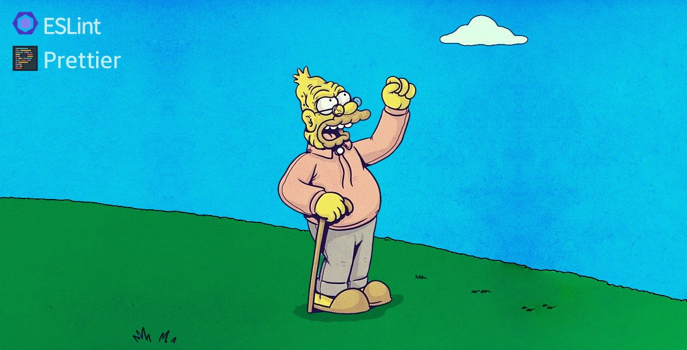

# eslint-config-get-off-my-lawn-prettier

> A highly opinionated, [sharable config](http://eslint.org/docs/developer-guide/shareable-configs.html) of [ESLint](http://eslint.org) rules to produce beautiful, readable JavaScript, optimized for seamless use with [Prettier](https://prettier.io/).



All the crankiness of [eslint-config-get-off-my-lawn](https://github.com/manovotny/eslint-config-get-off-my-lawn), but with all the rules that might conflict with [Prettier](https://prettier.io/) turned off.

## Install

```
$ yarn add eslint eslint-config-get-off-my-lawn-prettier --dev
```

## Usage

Create an ESLint config in your `package.json` or `.eslintrc.js` file.

### package.json

```json
{
    "name": "my-awesome-project",
    "eslintConfig": {
        "extends": "get-off-my-lawn-prettier",
        "rules": {
            // enable additional rules, override rule options, or disable rules
        }
    }
}
```

### .eslintrc.js

```js
module.exports = {
    extends: 'get-off-my-lawn-prettier',
    rules: {
        // enable additional rules, override rule options, or disable rules
    }
};
```

## Related

-   [eslint-config-get-off-my-lawn](https://github.com/manovotny/eslint-config-get-off-my-lawn) - A highly opinionated, [sharable config](http://eslint.org/docs/developer-guide/shareable-configs.html) of [ESLint](http://eslint.org) rules to produce beautiful, readable JavaScript.
-   [stylelint-config-get-off-my-lawn](https://www.npmjs.com/package/stylelint-config-get-off-my-lawn) - A highly opinionated, [sharable config](https://github.com/stylelint/stylelint/blob/master/docs/user-guide/configuration.md#extends) of [stylelint](http://stylelint.io) rules to produce beautiful, readable CSS and Sass.

## License

MIT © [Michael Novotny](http://manovotny.com)
